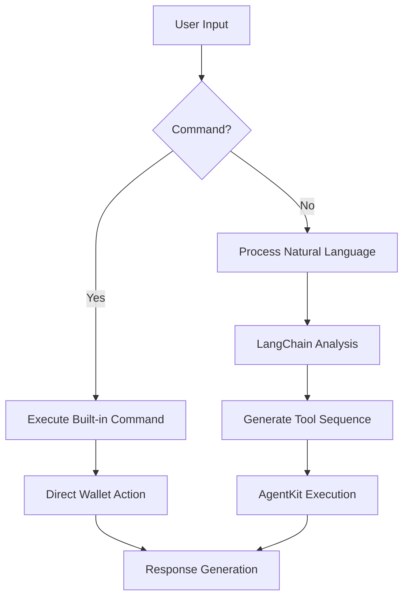

# DeFi Copilot Architecture Overview

## Application Flow (index.js)
- **Initialization**: Checks `memory.json` for existing profiles using Coinbase's AgentKit wallet persistence model([1](https://github.com/coinbase/agentkit))
- **Agent Orchestration**:
  - Uses LangChain's AgentExecutor for conversation management([2](https://js.langchain.com/docs/modules/agents/))
  - Implements AgentKit's wallet provisioning system for on-chain interactions
- **State Management**:
  - `sessionState` object tracks:
    - User profile (Zod-validated schema)
    - Active agent context
    - Wallet connections (via AgentKit's EIP-1193 implementation)
  - Persists state using AgentKit's encrypted storage adapters

### Enhanced Workflow:
1. Profile check with AgentKit's wallet recovery flow
2. Onboarding using LangChain's ConversationChain
3. Profile validation with Zod schema enforcement
4. Wallet provisioning via AgentKit's testnet faucet integration
5. Portfolio management using AgentKit's DeFi action toolkit

## Onboarding Agent (onboardingAgent.js)
**Purpose**: AI-guided profile creation with on-chain identity setup

### Enhanced Features:
- **LangChain Integration**:
  - GPT-4 Turbo via `ChatOpenAI` class
  - Message history management with `AIMessage`/`HumanMessage`
  - Structured output parsing using `StructuredOutputParser`
  
- **AgentKit Components**:
  ```javascript
  // AgentKit wallet creation trigger
  if (input.trim().toUpperCase() === "CREATE_WALLET") {
    // Uses AgentKit's testnet faucet integration
    const wallet = await AgentKit.createWallet();
  }
  ```
- **Profile Management**:
  - Combines LangChain's memory systems with AgentKit's encrypted storage
  - Automatic extraction of DeFi preferences using NLP patterns

## Portfolio Agent (portfolioAgent.js) - Detailed Implementation

### Core Components
**1. Agent Initialization Flow:**
```javascript
export async function initializePortfolioAgent(profile) {
  // 1. Environment Validation
  validateEnvironment(); // Checks OPENAI_API_KEY, PRIVATE_KEY
  
  // 2. Viem Wallet Configuration
  const client = createWalletClient({
    account: privateKeyToAccount(process.env.PRIVATE_KEY),
    chain: baseSepolia,
    transport: http()
  });
  
  // 3. AgentKit Setup
  const agentKit = await AgentKit.from({
    walletProvider: new ViemWalletProvider(client),
    actionProviders: [
      walletActionProvider(),       // Basic wallet operations
      pythActionProvider(),         // Price feeds
      wethActionProvider(),         // WETH wrapping
      morphoActionProvider()        // Lending/borrowing
    ]
  });

  // 4. LangChain Integration
  const tools = await getLangChainTools(agentKit);
  const model = new ChatOpenAI({
    modelName: "gpt-3.5-turbo",
    temperature: 0.5
  });
  
  // 5. Agent Configuration
  return createReactAgent({
    llm: model,
    tools,
    messageModifier: `...educational assistant prompt...`
  });
}
```

**2. Command Processing Architecture:**
```javascript
export async function runPortfolioAgent({ agent, config }) {
  // Command definitions
  const commands = {
    'balance': 'Check wallet balance',
    'send': 'Send tokens',
    'receive': 'Show wallet address',
    'history': 'Transaction history',
    'help': 'Show commands',
    'quit': 'Exit'
  };

  // Response handling pipeline
  const stream = await agent.stream({ 
    messages: [new HumanMessage(message)] 
  }, config);
  
  for await (const chunk of stream) {
    if ("agent" in chunk) {
      console.log('Assistant:', chunk.agent.messages[0].content);
    } 
    if ("tools" in chunk) {
      console.log(chunk.tools.messages[0].content);
    }
  }
}
```

### Key Technical Features
1. **Wallet Management**
   - Viem integration for secure private key handling
   - Base Sepolia testnet configuration
   - Multi-provider architecture:
     - WalletProvider: Account management
     - ActionProviders: DeFi protocol integrations

2. **LangChain Implementation**
   - React Agent pattern for stateful conversations
   - Streaming response handling
   - Tool integration pattern:
     ```javascript
     const tools = await getLangChainTools(agentKit);
     // Includes:
     // - Balance checks
     // - Transaction history
     // - Token transfers
     // - DeFi protocol interactions
     ```

3. **Security Features**
   - Environment variable validation
   - Encrypted private key storage
   - Session isolation through thread IDs
   - Error handling for failed transactions

### Workflow Diagram


### Dependencies
| Package | Version | Purpose |
|---------|---------|---------|
| `@coinbase/agentkit` | ^0.5.2 | On-chain operations |
| `viem` | ^2.9.16 | Wallet management |
| `@langchain/openai` | ^0.1.4 | LLM integration |
| `@langchain/langgraph` | ^0.0.8 | Agent orchestration |
| `inquirer` | ^9.2.12 | CLI interactions |

## Technical Integration
| Layer        | Components                                                                 |
|--------------|----------------------------------------------------------------------------|
| **AI**       | LangChain.js Agents, GPT-4 Turbo, Custom Tools                             |
| **Blockchain**| AgentKit Wallet SDK, Ethers.js, Smart Contract ABIs                       |
| **Storage**  | Encrypted Local Storage, IPFS for transaction history                     |
| **Security** | AgentKit's Session Keys, LangChain Prompt Injection Protections           |

This architecture combines LangChain's conversational AI capabilities with AgentKit's on-chain operation toolkit([3](https://github.com/coinbase/agentkit/blob/master/CONTRIBUTING-TYPESCRIPT.md)), following Coinbase's best practices for AI-agent wallet management.
